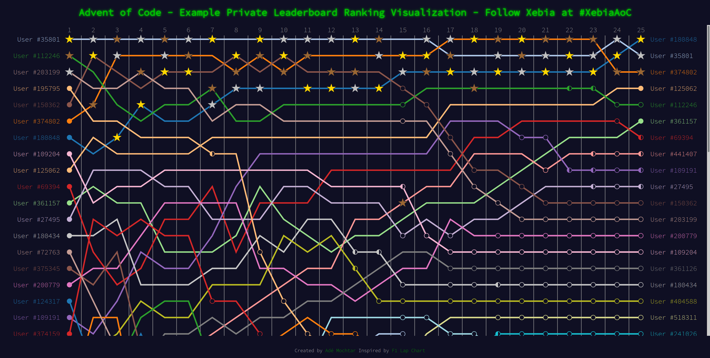

# Advent of Code private leaderboard ranking extension

Visualize the ranking over time of an [Advent of Code](https://www.adventofcode.com/) private leaderboard.

See https://amochtar.github.io/aoc-ranking/ for an interactive example.

## Installation

* Firefox - https://addons.mozilla.org/en-US/firefox/addon/aoc-ranking/
* Chrome - https://chrome.google.com/webstore/detail/advent-of-code-ranking/jbnlafikncgjjhdkmfhokcplgahebmjl

## Building locally

To build the extension locally, run `npm install && npm run build`. This will generate an exploded version of the extension in the `dist/` folder.

Use [`web-ext run`](https://github.com/mozilla/web-ext) from the `dist/` folder to run it locally in Firefox, or `web-ext build` to create a package.
